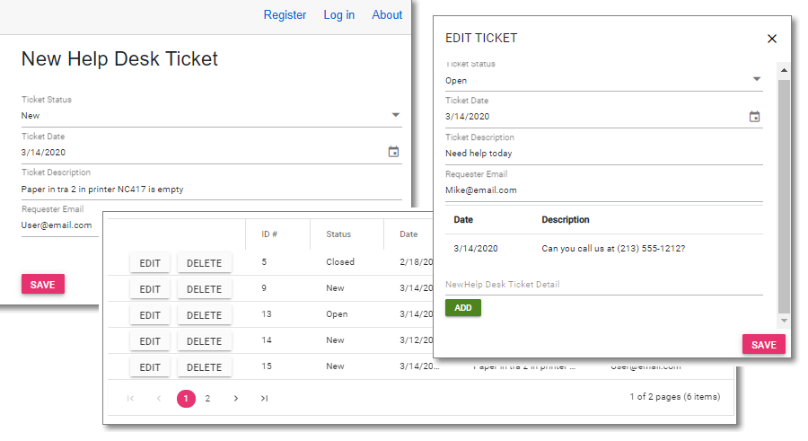

# SyncfusionHelpDesk

## Covered in the Book:
[Blazor Succinctly](https://www.syncfusion.com/ebooks/blazor-succinctly)

### To Install

1) Create a Database on your SQL server, and run scripts in **!SQL directory**
2) Edit *appsettings.json* to set the database connection in the **DefaultConnection** property
3) Run the application, click the *Register* link and create a user named **Administrator@Email**
4) Log out and log back in as **Administrator@Email**. You will now be the **Administrator** 

### To Enable Emails

1) Get an **API key** from [app.sendgrid.com](https://app.sendgrid.com)
2) Open **appsettings.json**: 
- *Uncomment* the '//' before **SENDGRID_APIKEY** and enter your **SendGrid API key** in place of: **{{ uncomment and enter your key from app.sendgrid.com }}**
- *Uncomment* the '//' before **SenderEmail** and enter your Email address in place of: **{{ uncomment and enter your email address }}**
